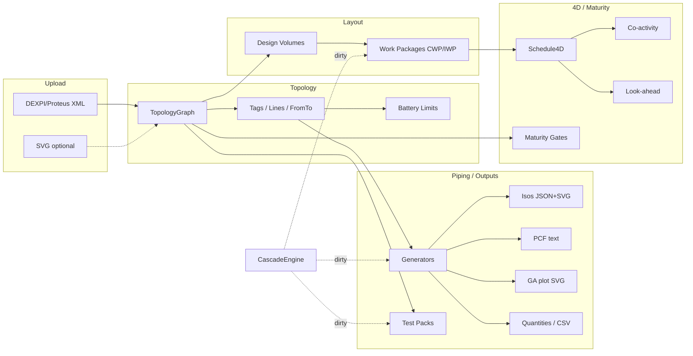

# ThreadForge

**Agent-native EPC piping digital thread** (geometrically correct routes/PCF/clash; externally drivablen via FastAPI/MCP) — P&ID (Proteus/DEXPI-shaped XML) → topology graph → layout / design volumes → piping artefacts → AWP work packages → 4D schedule (co-activity + look-ahead), with maturity gates.

Inspired by public industrial digital-twin UI *patterns* (P&ID selection, Pid-to-3d pipeline, work packages, 4D planning). **Not** a brand or UI clone.

Hard limits (proprietary CAD, full DEXPI XSD, etc.) are documented in **[WALLS.md](WALLS.md)**.

## Architecture



## Acceptance (AUTO-GENERATED from scripts/acceptance.py)

Do not hand-edit the table below — regenerate via `python scripts/acceptance.py`.

```
A01 PASS status=validated engine=xmlschema errors=0
A02 PASS seg=23 eq=21 nz=21 sized=19 pif=6 dn_ok=True
A03 PASS xmls=2 joins=1 pinned=1
A04 PASS errors=none gaps=6
A05 PASS fabricated_lines=['LINE-120-P-1002'] flagged=2 refuses_ifc=True
A06 PASS mismatches=none lines=4
A07 PASS max_bends=2 clears=True clear_meta=True drains=True
A08 PASS rich_hard=0 crafted_hard=1 excluded_keys=True
A09 PASS supports_per_line={'LINE-200-P-1001': 6, 'LINE-200-P-1002': 15, 'LINE-210-G-2001': 8, 'LINE-200-D-1010': 7} expected={'LINE-200-P-1001': 6, 'LINE-200-P-1002': 15, 'LINE-210-G-2001': 8, 'LINE-200-D-1010': 7} types_ok=True
A10 PASS problems=none files=4
A11 PASS parsed=4
A12 PASS checks=[True, True, True, True, True, True] cited=True keys=[0.5, 0.75, 1.0, 1.5, 2.0, 3.0, 4.0, 5.0, 6.0, 8.0, 10.0, 12.0]
A13 PASS svg30=True bom=True nfc=True
A14 PASS segments=9 fittings=5 pset=True
A15 PASS entities=21 layers=['0', 'Defpoints', 'VOL_VOL-200', 'VOL_VOL-210', 'VOL_VOL-220', 'VOL_VOL-RACK', 'EQP', 'PIP', 'ISO', 'INS'] has_vol=True has_disc=True art=ready
A16 PASS rows=4 keys_ok=True recon=True
A17 PASS packs=6 with_pressure=6 sample={'boundary': ['FlowInPipeOffPageConnector-1', 'Nozzle-1', 'Nozzle-2', 'Nozzle-3', 'Nozzle-4', 'Nozzle-5'], 'test_pressure_barg': 90.0, 'design_pressure_barg': 60.0}
A18 PASS total=30 iwps=23 size_ok=True qty_ok=True crew_ok=True
A19 PASS hard=1 soft=6 keys=['adjacent_count', 'craft_warnings', 'flagged', 'flagged_count', 'hard_count', 'message', 'same_volume_count', 'soft_adjacent']
A20 PASS dirty={'dirty': True, 'change_id': 'CHG-7bf4a640', 'artefact_kinds': ['routes', 'supports', 'isometric', 'quantities', 'pcf', 'clash', 'ga', 'test_pack', 'work_package'], 'artefact_ids': ['ART-200-P-1002.pcf', 'ART-200-P-1001.pcf', 'ART-200-D-1010.pcf', 'ART-210-G-2001.pcf'], 'affected_wp_ids': [], 'affected_stages': ['topology', 'piping', 'outputs']} line=LINE-200-P-1001
A21 PASS level=L3_60 reasons={'fabricated_count': 0, 'unmatched_opc_count': 0, 'design_pressure_present': False, 'clash_hard': 0, 'factors': ['tags+sheets', 'topology', 'layout+equipment']}
A22 PASS bad_status=404 openapi_committed=True
A23 PASS mcp_server present
A24 PASS health=200 tools=401
A25 PASS status=202 body={"id":"job-18c8b67d4d","job_id":"job-18c8b67d4d","status":"queued"}
A26 PASS keys=['status', 'fail_closed', 'data_dir_writable', 'registry_schema', 'fixture_shas', 'schema_version']
A27 PASS missing=none
A28 PASS ci_missing=none
A29 PASS changelog=True regen=True tools_mapped=True
A30 PASS tags=['v1.0.0'] has_v1=True
ACCEPTANCE: 30/30 PASS
```

## REAL vs STUB

| Capability | Status | Notes |
|---|---|---|
| DEXPI/Proteus-**shaped** XML parse | **REAL** (subset) | Lite + rich fixtures; see WALLS for XSD certification |
| Multi-sheet, Equipment, Nozzle XYZ, PipingNetworkSegment, Instrument / ProcessInstrumentFunction, BatteryLimit | **REAL** | Attribute-tolerant |
| Topology graph (tags, lines, from-to, BL) | **REAL** | In-memory |
| Cascade dirty tracking + re-run | **REAL** | Marks artefacts/stages/WPs |
| Test packs from system boundaries | **REAL** | Membership via connectivity |
| Work packages from volumes × discipline | **REAL** | AWP-shaped CWP/IWP |
| Schedule JSON/CSV import | **REAL** | |
| Co-activity (time ∩ same volume) + volume report | **REAL** | JSON export |
| Look-ahead + discipline filters (PIP/INS/ELE/TEL) + CSV | **REAL** | |
| Maturity gate (block IFC export) | **REAL** | |
| Quantities (counts + shared A* lengths) | **REAL** | Lengths from `graph.routes` (A*) |
| CSV tag/line export | **REAL** | `.csv` files under `output/csv/` |
| PCF writer | **REAL** (structurally valid) | Contiguous PIPE/ELBOW; certification WALL |
| Isometric package | **REAL** (true 30° SVG + JSON) | Not ISOGEN stamped drawing — WALL |
| GA / plot plan SVG + DXF | **REAL** | Volume AABB + equipment; ezdxf optional |
| Piping routes + supports | **REAL** (A* + MSS spans) | Manhattan fallback flagged |
| Clash detection | **REAL** (capsule math) | W7 removed |
| IFC4 export | **REAL** (optional ifcopenshell) | NWD/RVT/DGN/DWG still WALL |
| Engineering tables | **REAL** (B36.10/MSS/B16.5/B31.3) | Cited in `tables.py` |
| FastAPI + MCP + SQLite registry | **REAL** | `threadforge.server` |
| Agent SYSTEM.md + JSONL REPL | **REAL** | `agent/run_repl.py` |
| Vendor DEXPI extensions / live APIs / client data | **WALL** | See WALLS.md |
| Web 3D viewer / Gantt UI | **OUT OF SCOPE** | Data + tools only |

## Package layout

```
threadforge/
  WALLS.md
  README.md  ROADMAP.md  LICENSE
  pyproject.toml  requirements.txt
  src/threadforge/
    models.py  graph.py  ingest_dexpi.py  cascade.py
    generators.py  routing.py  schedule_4d.py  maturity.py
    agent_tools.py  cli.py
  fixtures/          # sample_pid.xml, sample_pid_rich.xml, schedule
  output/            # demo PCF / ISO / GA / routes (generated)
  agent/             # SYSTEM.md, run_repl.py, demo_turns.jsonl
  tests/
  demos/run_demo.py
```

## Install & run

```bash
cd /workspace/threadforge
pip install -e ".[dev]"
pytest -q
python demos/run_demo.py
PYTHONPATH=src python agent/run_repl.py agent/demo_turns.jsonl
# or: threadforge ingest && threadforge query --summary
```

Without editable install:

```bash
pip install -r requirements.txt
PYTHONPATH=src pytest -q
PYTHONPATH=src python demos/run_demo.py
```

## Agent tools

| Tool | Purpose |
|---|---|
| `ingest_dexpi` | Parse XML → graph |
| `query_graph` | Tags / neighbors / summary |
| `revise_pid` | Change tag/line → dirty set |
| `cascade_rerun` | Re-generate dirty artefacts |
| `build_test_packs` | System-boundary test packs |
| `build_work_packages` | Volume × discipline WPs |
| `attach_schedule` | Load JSON/CSV schedule |
| `look_ahead` | Window + discipline filter + optional CSV |
| `co_activity_check` | Time ∩ volume clashes + report |
| `maturity_check` | Gate IFC-grade export |
| `run_pipeline_stage` | Run upload…outputs stages |
| `export_artefacts` | Write PCF/ISO/GA/routes under `output/` |
| `dexpi_coverage` | Supported elements vs WALL gaps |

## License

MIT — see `LICENSE`.
